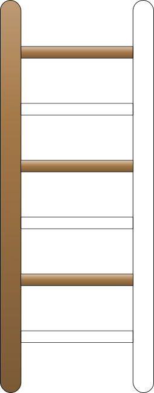

```{r setup, include=FALSE}
options(htmltools.dir.version = FALSE)
library(icon)
```

layout: true

<div class="my-footer"><span>Episode 1: Series Overview
&emsp;&emsp;&emsp;&emsp;&emsp;&emsp;&emsp;&emsp;&emsp;&emsp;&emsp;&emsp;&emsp;
&emsp;&emsp;&emsp;&emsp;&emsp;&emsp;&emsp;&emsp;&emsp;&emsp;&emsp;&emsp;&emsp;&emsp;Shiny App Development Series</span></div> 

---

# About Me

.pull-left[

`r fa_briefcase()` Statistician in Life Sciences

`r fa_r_project()` user for 14 years

Creator/Host of the R-Podcast: [r-podcast.org](https://r-podcast.org)

Contributor to R Weekly service: [rweekly.org](https://rweekly.org)

RStudio Community sustainer: [community.rstudio.com](https://community.rstudio.com)

Rbind service administrator: [support.rbind.io](https://support.rbind.io/)

Discovered `shiny` in 2013 and immediately hooked!

]

.pull-right[


]

---
class: clear, fullscreen, inverse, top, center, text-white
background-image: url(img/Foundation-M2325.jpg)

.font150[**Setting our Foundation**]

---

# Learning the Shiny Basics

.left-column-big[
__Shiny__ is an R package enabling you to create dynamic and interactive web applications directly with `r fa_r_project()` code

I recommend the following resources to help you begin to climb the [__shiny ladder of enlightenment__](https://github.com/rstudio/ShinyDeveloperConference/blob/master/Reactivity/slides.Rmd#ladder-of-enlightenment):

* [**Building Web Applications in R with Shiny**](https://www.datacamp.com/courses/building-web-applications-in-r-with-shiny): Free DataCamp course
* Various webinars/conference presentations from RStudio:
    + [Effective Reactive Programming](https://www.rstudio.com/resources/videos/effective-reactive-programming/)
    + [Debugging Techniques](https://www.rstudio.com/resources/videos/debugging-techniques/)
* [Building Shiny apps - an interactive tutorial](https://deanattali.com/blog/building-shiny-apps-tutorial/) (Dean Attali)
* [A totally different, read-me-first Shiny tutorial](http://www.open-meta.org/technology/a-totally-different-read-me-first-shiny-tutorial/) (Tom Weishaar)
]

.right-column-small[
.center[]
]


---
class: center, middle, inverse

# What can shiny `r fa_lock_open()` for you?


---
class: clear, fullscreen, inverse, top, center, text-white

```{r eval=FALSE, echo=FALSE}
knitr::include_app("https://vnijs.shinyapps.io/radiant/", height = "600px")
```

https://vnijs.shinyapps.io/radiant/
---

# The Journey Begins!

* Share techniques, snippets, and practical advice gained from my use of `shiny`
* Explore fascinating uses of `shiny` in the `r fa_r_project()` community
* Illustrate techniques for enhancing your `shiny` applications with additional packages
* Hands-on code walkthroughs with experts in `shiny` application development

<br><br><br>

.center[
.content-box-blue-centre[Visit [shinydevseries.com](https://shinydevseries.com) for all videos and resources!] 
]


